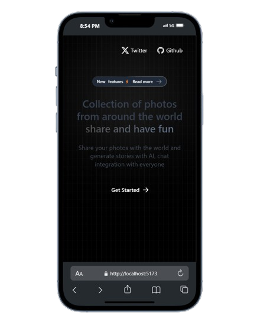

# 🌩️ Cloud Gallery

**Cloud Gallery** is a public cloud-style app where you can upload your most random photos and share them with the world. Powered by AI, it also lets you generate stories and analyze photo content.

---

## ✨ Features

🐧🦖 
- **Text generation**
- **Image detection**
- **Image upload**
- **User authentication**
- **User profile**

## ⏳ Future Features

✅⌛
- Global chat
- Private cloud storage
- Private chats
- AI-powered image editing
- Share images via chat

---

## ⚙️ Technologies Used

🛠️
- **React.js**
- **Supabase**
- **TailwindCSS**
- **Cloudinary**
- **Google Gemini**
- **React-router-dom v6**

---

## 📖 Is it Open Source?

If **Cloud Gallery** is open source, you can contribute by enhancing the app, adding new features, fixing bugs, and more. Your contributions help improve the project and benefit the community!

---

## 📸 Screenshots

### Mobile View



### Desktop View


---

## ⚙️ Setup

To use this project, you'll need your Cloudinary credentials. You will need the following:

- **Cloud Name**: Your Cloudinary account name.
- **API Key and Secret**: The API key, followed by a colon, and then the secret API key (e.g., `7374ee773ufyye3:2372372737273ee2372`).

### Steps for Configuration

1. **Create a `.env` file** in the root of your project (if you don’t have one already).

2. **Add the following variables** to the `.env` file:

   ```env
   VITE_PUBLIC_CLOUD_NAME="your_cloud_name_here"  # e.g., "my_cloud"
   VITE_SECRET_API_KEY="7374ee773ufyye3:2372372737273ee2372"  # API Key and Secret
   VITE_CLOUDINARY_FOLDER="your_folder_here"       # e.g., "uploads"
   VITE_GOOGLE_GEMINI_API="your_gemini-api-key"    # e.g., "eru4uwu4422ueeesd32frt5434eerr"
   VITE_SUPABASE_URL="your-supabase-url"           # e.g., "https://supa.xdrovbk.co"
   VITE_SUPABASE_ANON_KEY="your-supabase-anon-key"
   ```

## 🚀 Running the Project
To run the project, you can use any of the following package managers: pnpm, npm, or yarn. Here’s how to do it with each:

## Using pnpm
Make sure you have pnpm installed. If you haven't installed it yet, you can do so with:

```bash
npm install -g pnpm
```
Install dependencies and run the project:

``` bash
pnpm i && pnpm run dev
```
Or, using npm:

```bash
npm i && npm run dev
```
Or, using yarn:

```bash
yarn add && yarn run dev
```
## 🤝 Contributing
We welcome contributions to Cloud Gallery! Here’s how you can help:

Fork the Repository: Create a personal copy of the repository by clicking the "Fork" button on GitHub.

Clone the Forked Repository: Clone your fork to your local machine:

```bash
git clone https://github.com/your-username/Cloud-gallery.git
```
## 📁 Project Structure
See Project Structure

[project Structure](./ARCHITECTURE.md)

---
By following these guidelines, you help us improve the project and make it better for everyone!

Feel free to customize the repository link and any other specific details as needed!

