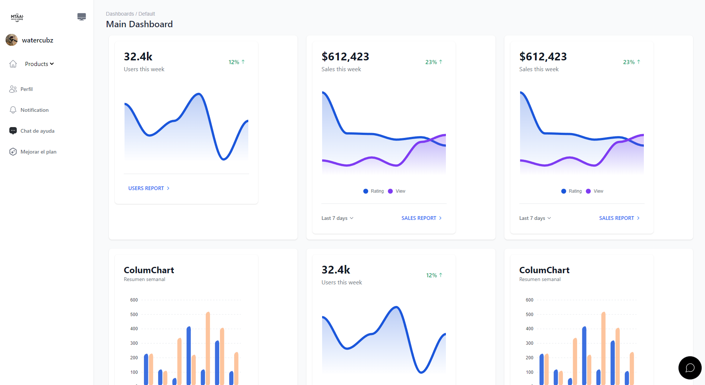

# 🌩️ Cloud Gallery

**Cloud Gallery** is a public cloud-style app where you can upload your most random photos and share them with the world. Powered by AI, it also lets you generate stories and analyze photo content.

---

## ✨ Features

- **Text generation**
- **Image detection**
- **Image upload**
- **User authentication**
- **User profile**

## ⏳ Future Features

- Global chat
- Private cloud storage
- Private chats
- AI-powered image editing
- Share images via chat

---

## ⚙️ Technologies Used

- **React.js**
- **Supabase**
- **TailwindCSS**
- **Cloudinary**
- **Google Gemini**
- **Vitest**
- **React-router-dom v6**

---

## 📖 Is it Open Source?

If **Cloud Gallery** is open source, you can contribute by enhancing the app, adding new features, fixing bugs, and more. Your contributions help improve the project and benefit the community!

---

## 📸 Screenshot



---

# ⚙️ Setup

To use this project, you'll need your Cloudinary credentials. You will need the following:

- **Cloud Name**: Your Cloudinary account name.
- **API Key and Secret**: The API key, followed by a colon, and then the secret API key (e.g., `7374ee773ufyye3:2372372737273ee2372`).

### Steps for Configuration

1. **Create a `.env` file** in the root of your project (if you don’t have one already).

2. **Add the following variables** to the `.env` file:

   ```env
   VITE_PUBLIC_CLOUD_NAME="your_cloud_name_here"  # e.g., "my_cloud"
   VITE_SECRET_API_KEY="7374ee773ufyye3:2372372737273ee2372"  # API Key and Secret
   VITE_CLOUDINARY_FOLDER="your_folder_here"       # e.g., "uploads"
   VITE_GOOGLE_GEMINI_API="your_gemini-api-key"    # e.g., "eru4uwu4422ueeesd32frt5434eerr"
   VITE_SUPABASE_URL="your-supabase-url"           # e.g., "https://supa.xdrovbk.co"
   VITE_SUPABASE_ANON_KEY="your-supabase-anon-key"
   ```

## 🚀 Running the Project

To run the project, you can use any of the following package managers: pnpm, npm, or yarn. Here’s how to do it with each:

## Using pnpm

Make sure you have pnpm installed. If you haven't installed it yet, you can do so with:

```bash
npm install -g pnpm
```

Install dependencies and run the project:

```bash
pnpm i && pnpm run dev
```

Or, using npm:

```bash
npm i && npm run dev
```

Or, using yarn:

```bash
yarn add && yarn run dev
```

## 🐳 Setup Guide for Running **Cloud Gallery** with Docker

Follow these steps to set up and run Cloud Gallery using Docker.

## Prerequisites

- Ensure Docker and Docker Compose are installed on your machine.
  - [Docker Installation Guide](https://docs.docker.com/get-docker/)
  - [Docker Compose Installation Guide](https://docs.docker.com/compose/install/)

---

## Step 1: Clone the Repository

First, clone the repository to your local machine:

```bash
git clone https://github.com/your-username/cloud-gallery.git
cd cloud-gallery
```

## Step 2: Set Up Environment Variables
Create an .env file in the project root if one doesn’t already exist.
Add necessary environment variables for Cloud Gallery, such as database credentials, API keys, and any other required configuration.
Example .env file:

  ```env
   VITE_PUBLIC_CLOUD_NAME="your_cloud_name_here"  # e.g., "my_cloud"
   VITE_SECRET_API_KEY="7374ee773ufyye3:2372372737273ee2372"  # API Key and Secret
   VITE_CLOUDINARY_FOLDER="your_folder_here"       # e.g., "uploads"
   VITE_GOOGLE_GEMINI_API="your_gemini-api-key"    # e.g., "eru4uwu4422ueeesd32frt5434eerr"
   VITE_SUPABASE_URL="your-supabase-url"           # e.g., "https://supa.xdrovbk.co"
   VITE_SUPABASE_ANON_KEY="your-supabase-anon-key"
   ```
# Add any other necessary variables here

## Step 3: Build the Docker Images
Build the Docker images using Docker Compose:

```
docker build -t atxpaul/react.app
```
This command will create the necessary Docker images for the application and its dependencies (e.g., database, web server).

## Step 4: Run the Containers
Start the containers with Docker Compose:

```
docker-compose up
```

This command will launch all the necessary containers.
The app should now be accessible at http://localhost:5173 (or the port specified in your Docker configuration).

## Step 5: Verify the Setup
Open your browser and go to http://localhost:5173.

Verify that the application is running correctly.

Check the logs for any errors by running:

```
docker-compose logs -f
```
## Additional Commands
Stop the Containers: To stop the running containers, use:
```
docker-compose down
```
Rebuild the Containers: If you make changes to the Docker configuration or code, rebuild the images:
```
docker-compose up --build
```

## 🤝 Contribution Guide for **Cloud Gallery**

Thank you for your interest in improving Cloud Gallery! Please follow these three simple steps to submit your contributions:

## Step 1: Description of the Issue or Feature

- **Issue or Improvement**: Clearly explain the bug you found or the new feature you'd like to add.
- **Technical Details**: Include technical details such as your operating system, browser, or application version, if relevant.

Example:
```markdown
**Description**: The app freezes when trying to upload an image larger than 5MB.
**Technical Details**: Windows 10, Chrome 114, Cloud Gallery version 1.2.3.
```

## Step 2: Screenshots of the Implemented Changes
Include screenshots or gifs that show the interface changes or the effect of your contribution. Images should be clear and, if possible, show both the issue before your changes and the final result.

Example:

Before: PHOTO

After: PHOTO

## Step 3: Description of the Changes Made
Detailed Explanation: Describe the changes you made in the code and why.
App Impact: Explain how your contribution improves the application or solves the problem.

**Description of Changes**: 
- Increased the maximum upload size to 10MB to prevent freezing.
- Added an error message for oversized files.

**Impact**: Users now receive a warning if their file is too large, and the app no longer freezes.

That’s it! After following these steps, submit your pull request, and our team will review your contribution.

Thank you for making Cloud Gallery a better application


## 📁 Project Structure

See Project Structure

[project Structure](./ARCHITECTURE.md)

---

By following these guidelines, you help us improve the project and make it better for everyone!
